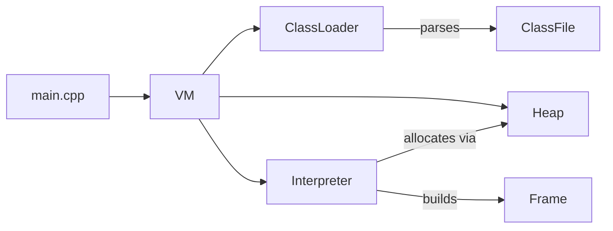

# gothic-jvm

A small, educational **Java Virtual Machine** written in modern **C++23**. It parses
`.class` files, builds a runtime model of classes, and interprets JVM bytecode. The
default workload is a J2ME-style MIDlet: the `HG` main class shipped under
`gothic3thebeginning/`. The goal is to implement *just enough* of a VM to bring that
MIDlet to life.

> ⚠️ **Status: early and partial.** Only a subset of JVM opcodes is implemented, a
> handful of standard-library methods are backed by C++ "native" callbacks, there is no
> garbage collector, and runtime errors surface as C++ exceptions rather than Java ones.
> This is a learning project, not a production VM.

## What works today

- Parsing `.class` files (constant pool, fields, methods, the `Code` attribute, MUTF-8).
- Classpath-based class loading with caching, plus synthesized array and primitive classes.
- Class initialization (`<clinit>`) with superclass-first ordering and state tracking.
- A tree-walking bytecode interpreter covering constants, loads/stores, integer/long math,
  branches, field access, object/array creation, and `invokevirtual` / `invokespecial` /
  `invokestatic`.
- Real `java.lang.String` objects materialized from string constants.
- A small set of native methods (timing, canvas size, `getClass`, `String.charAt`, …).

## Getting started

### Prerequisites

- A C++23-capable compiler (developed with MSVC / Visual Studio 2022).
- CMake ≥ 3.28.
- A JDK providing `javac` (old enough to accept `-source 1.3 -target 1.1`) — CMake compiles
  the bootstrap `java_classes/*.java` sources at build time.
- The GoogleTest submodule under `third_party/gtest`.

### Clone

```
git clone --recurse-submodules <repo-url>
```

If you already cloned without submodules:

```
git submodule update --init --recursive
```

### Build

```
cmake -S . -B build
cmake --build build
```

The build also drives `javac` (via the `java_classes` CMake target) to compile the
hand-maintained runtime classes under `java_classes/` into `build/java_classes/`.

### Test

```
ctest --test-dir build
```

Tests currently cover only the binary reader (see `tests/`). The earlier class-file parsing
test was removed, so there is no automated coverage of parsing or the interpreter yet.

### Run

The `app` executable takes an optional main class followed by optional classpath entries:

```
app <main-class> [<classpath-entry> ...]
```

With no arguments it defaults to the `HG` MIDlet and looks for classes under
`<cwd>/gothic3thebeginning`. Because the classpath is assembled from the **current working
directory**, run it from a directory that contains `java_classes/` and
`gothic3thebeginning/`. The build compiles `java_classes/` into `build/java_classes/` for you.

## How it works

At a high level:

1. `main` constructs a `VM` for the chosen main class and configures the classpath.
2. The `VM` eagerly loads a few bootstrap classes, then loads and initializes the main class.
3. It instantiates the MIDlet, runs its `<init>`, and calls `startApp()`.
4. The `Interpreter` executes bytecode frame by frame, dispatching opcodes in a large switch.



Core components:

- **ClassLoader / ClassFile** — resolve and parse `.class` files off the classpath.
- **Class / Method / Field** — the runtime model, including lazy constant-pool resolution.
- **Interpreter / Frame** — the bytecode execution engine and per-call activation records.
- **Heap / Object** — object and array allocation; `Object` is a tagged union of instance,
  primitive-array, instance-array, and `java.lang.Class`-mirror data.

## Project layout

```
source/
  main.cpp            # entry point
  class_loader/       # .class parsing + classpath class loading
  runtime/            # VM, interpreter, classes, heap, objects, frames
  utils/              # big-endian binary reader
tests/                # GoogleTest unit tests
resources/            # vendored J2ME stdlib + MIDlet data
java_classes/         # hand-maintained bootstrap runtime classes (.java, compiled by CMake)
third_party/gtest/    # GoogleTest (submodule)
```

## Limitations, known issues & roadmap

### Known gaps & WIP

- Many opcodes are still unimplemented; the interpreter throws on anything it doesn't know,
  and JVM-level errors (null-pointer, divide-by-zero, array-store, out-of-bounds) surface as
  C++ exceptions rather than Java ones.
- No garbage collection — the heap only grows.
- No real Java exception objects or exception-handler dispatch yet: the parsed exception
  table is stored but never consulted, so `try`/`catch`/`finally` does not work.
- `checkcast` resolves its target class but performs **no** type check, and there is no
  `instanceof`.
- `invokespecial` `ACC_SUPER` (real `super.method()` dispatch) is unimplemented, and
  `invokeinterface` is missing entirely.
- Constant-pool parsing skips `Float` (tag 4) and `Double` (tag 6); a class that uses them
  fails to load.
- String interning does not deduplicate yet — every string literal allocates a fresh
  `java.lang.String` (the heap reserves a map for this but doesn't use it).

### Known issues / things that could be broken

- Only the ten `java_classes/*.java` sources listed in CMake are compiled; `java/lang/Object`
  (a committed prebuilt `.class`) and the other runtime classes the MIDlet needs are not
  reproduced by a clean build, so `build/java_classes/` currently relies on vendored copies.
- The native `getClass()` only handles ordinary instances — calling it on an array or a class
  mirror crashes instead of raising a Java error.
- Test coverage regressed to just the binary reader, and the build still injects a
  `TEST_FILES_DIR` path (`resources/test_files/`) that no longer exists.
- Several natives are silent no-op stubs (`ResourceInputStream.init`, `Font.init`) and the
  canvas size is hardcoded to 240×320, so anything relying on their real behaviour misbehaves
  quietly.

### Next steps

- Introduce real exception objects and exception-handler-table dispatch.
- Implement `invokeinterface`, `ACC_SUPER` super-calls, and `checkcast`/`instanceof` checks.
- Parse `Float`/`Double` constants and widen overall opcode coverage.
- Deduplicate interned strings and make a start on garbage collection.
- Restore parser/interpreter test coverage (and fix the stale `TEST_FILES_DIR`).

## For contributors and AI agents

A detailed, always-current technical reference — architecture, type signatures, the exact
list of implemented opcodes, conventions, and known gaps — lives in
[CLAUDE.md](CLAUDE.md). It is written for AI coding agents but is equally useful as a deep
map of the codebase for human contributors.
