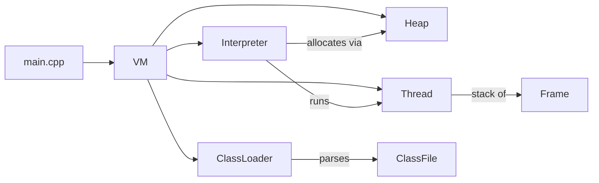

# gothic-jvm

A small, educational **Java Virtual Machine** written in modern **C++23**. It parses
`.class` files, builds a runtime model of classes, and interprets JVM bytecode. The default
workload is a J2ME-style MIDlet: the `HG` main class shipped under `gothic3thebeginning/`.
The goal is to implement *just enough* of a VM to bring that MIDlet to life.

> ⚠️ **Status: early and partial.** Only a subset of JVM opcodes is implemented, a handful
> of standard-library methods are backed by C++ "native" callbacks, there is no garbage
> collector, and runtime errors surface as C++ exceptions rather than Java ones. This is a
> learning project, not a production VM.

## What works today

- Parsing `.class` files (constant pool, fields, methods, the `Code` attribute, modified UTF-8).
- Classpath-based class loading with caching, plus synthesized array and primitive classes.
- Lazy, superclass-first class initialization (`<clinit>`) driven off an explicit per-thread
  frame stack rather than C++ recursion.
- A stackless, budgeted bytecode interpreter — `run(thread, n)` executes up to `n` instructions
  against a thread's explicit frame stack — covering constants, loads/stores, integer/long math,
  branches, `tableswitch`/`lookupswitch`, field access, object/array creation, monitors, `athrow`,
  and `invokevirtual`/`invokespecial`/`invokestatic`/`invokeinterface`.
- A rudimentary cooperative scheduler: `VM::run` round-robins every live green thread a
  500-instruction quantum at a time, and `java.lang.Thread.start` spawns new green threads (each an
  explicit frame stack). There is still no yielding, blocking, or priorities.
- Bytecode-level exceptions: `athrow` plus `Code` exception-table dispatch make `try`/`catch`/
  `finally` work (handler types are matched by walking the superclass chain). Exception objects
  carry no message/stack-trace state yet, and most VM-internal faults still surface as C++
  exceptions — the one exception is a null receiver on a virtual/interface call, which now raises a
  real `NullPointerException`.
- Real `java.lang.String`/`StringBuffer` objects backed by native C++ payloads; string constants
  are interned and deduplicated.
- A set of native methods (timing, canvas size, `Class.forName`/`getClass`, `String`/`StringBuffer`
  operations, resource streaming, MIDP `Graphics`/`Image` drawing with PNG decoding via stb_image,
  and in-memory MIDP RMS record stores).
- An SDL3 window with a 2D renderer that opens on startup. The MIDP drawing primitives
  (`Graphics.fillRect`/`drawString`, `Image` surfaces) do real work but render to **offscreen**
  surfaces that are not yet blitted to the window (which just clears each frame and handles the
  window-close event).

## Getting started

### Prerequisites

- A C++23-capable compiler (developed with MSVC / Visual Studio 2022).
- CMake ≥ 3.28.
- A JDK providing `javac` (old enough to accept `-source 1.3 -target 1.1`) — CMake compiles the
  bootstrap `java_classes/*.java` sources at build time.
- The GoogleTest submodule under `third_party/gtest`.
- SDL3 is fetched and built automatically by CMake (`FetchContent`), so no manual install is
  needed — but the first configure clones and builds SDL from source, which takes a while.

### Clone

```
git clone --recurse-submodules <repo-url>
```

If you already cloned without submodules:

```
git submodule update --init --recursive
```

### Build

```
cmake -S . -B build
cmake --build build
```

The build also drives `javac` (the `java_classes` CMake target) to compile the hand-maintained
runtime classes under `java_classes/` into `build/java_classes/`.

### Test

```
ctest --test-dir build
```

Tests currently cover only the binary reader (see `tests/`).

### Run

The `app` executable takes an optional main class followed by optional classpath entries:

```
app <main-class> [<classpath-entry> ...]
```

With no arguments it defaults to the `HG` MIDlet and looks for classes under
`<cwd>/gothic3thebeginning`. Because the classpath is assembled from the **current working
directory**, run it from a directory that contains `java_classes/` and `gothic3thebeginning/`;
the build compiles `java_classes/` into `build/java_classes/` for you.

## How it works

1. `main` opens the SDL3 `Display` (window + renderer), constructs a `VM`, sets the chosen main
   class, connects the display, and configures the classpath.
2. `VM::run` (on a background thread) walks a small bootstrap state machine: it initializes
   `java/lang/String`, then the main class, then instantiates the MIDlet, runs its `<init>`, and
   calls `startApp()` — each step scheduled as frames on the VM's main `Thread`.
3. A `Thread` is an explicit JVM call stack (a stack of `Frame`s). The `Interpreter` runs a
   bounded number of instructions against the top frame and returns; `VM::run` round-robins every
   live thread a quantum at a time (a rudimentary cooperative green-thread scheduler), and
   `Thread.start` spawns more. Method calls and class `<clinit>`s push frames instead of recursing
   in C++.
4. `main` runs the window event/render loop until the user closes the window, then asks the VM to
   stop and joins the background thread.



Core components:

- **ClassLoader / ClassFile** — resolve and parse `.class` files off the classpath.
- **Class / Method / Field** — the runtime model, including lazy constant-pool resolution.
- **Interpreter / Thread / Frame** — the bytecode engine, a green thread's explicit call stack,
  and per-call activation records.
- **Heap / Object** — object and array allocation; `Object` is a tagged union of instance,
  primitive-array, instance-array, and `java.lang.Class`-mirror data.

## Project layout

```
source/
  main.cpp            # entry point
  class_loader/       # .class parsing + classpath class loading
  platform/           # SDL3 window + 2D renderer wrapper (Display) + in-memory MIDP RMS
  runtime/            # VM, interpreter, threads, classes, heap, objects, frames
  utils/              # big-endian binary reader
tests/                # GoogleTest unit tests
resources/            # vendored J2ME stdlib + MIDlet data
java_classes/         # hand-maintained bootstrap runtime classes (.java, compiled by CMake)
third_party/gtest/    # GoogleTest (submodule)
third_party/stb/      # vendored stb_image (PNG decoding for Image.createImage)
```

## Limitations & roadmap

Known gaps:

- **Cooperative green threads, minimal scheduling.** `VM::run` round-robins every live thread a
  500-instruction quantum at a time and `java.lang.Thread.start` spawns new green threads, but
  there is no yielding, blocking, priorities, or thread-state model, and the monitor opcodes never
  block.
- **JVM-internal errors surface as C++ exceptions.** Divide-by-zero, array-store, and out-of-bounds
  conditions throw `std::runtime_error` instead of Java exceptions (a null receiver on an
  `invokevirtual`/`invokeinterface` is the exception — it raises a real `NullPointerException`).
  Explicit `athrow` and the parsed exception table *do* work (`try`/`catch`/`finally` dispatch), but
  exception objects carry no message/stack-trace state and handler matching walks only the
  superclass chain.
- **No garbage collection** — the heap only grows.
- **Partial type/opcode coverage.** Many opcodes are unimplemented (the interpreter throws on
  anything it doesn't know); `checkcast` performs no type check and there is no `instanceof`;
  `invokespecial` `super`-dispatch (`ACC_SUPER`) is still unimplemented; `Float`/`Double`
  constant-pool entries fail to load.
- **Unbound `native` methods.** A few methods declared `native` in the bootstrap sources have no
  C++ binding yet (`System.identityHashCode`, `System.exit`, `Class.isInterface`), so calling them
  throws.
- **Runtime dependency classes are vendored.** The build compiles only the `java_classes/*.java`
  sources; other classes the MIDlet needs (`java/io/*`, `java/util/*`) come from vendored copies
  under `resources/classes/` and must be present in `build/java_classes/` at runtime.
- **MIDP graphics are offscreen.** `Graphics`/`Image` natives draw onto SDL surfaces that are
  never blitted to the window, so nothing is visible on screen yet.
- **Test coverage** is limited to the binary reader.

Roadmap:

- Flesh out the cooperative scheduler (yielding, blocking monitors, thread states) on top of the
  existing round-robin green threads.
- Give exceptions real object state (messages, stack traces) and synthesize VM-level exceptions
  (NPE, `ArithmeticException`, `ArrayStoreException`, …) instead of throwing `std::runtime_error`.
- Implement `super`-calls (`ACC_SUPER`) and `checkcast`/`instanceof` type checks.
- Parse `Float`/`Double` constants and widen opcode coverage.
- Blit the offscreen MIDP surfaces to the window and wire up the `Displayable`/`paint` model.
- Bind the remaining `native` methods, start on garbage collection, and restore parser/interpreter
  test coverage.

## For contributors and AI agents

A detailed, always-current technical reference — architecture, type signatures, the exact list of
implemented opcodes, conventions, and known gaps — lives in [CLAUDE.md](CLAUDE.md). It is written
for AI coding agents but is equally useful as a deep map of the codebase for human contributors.
